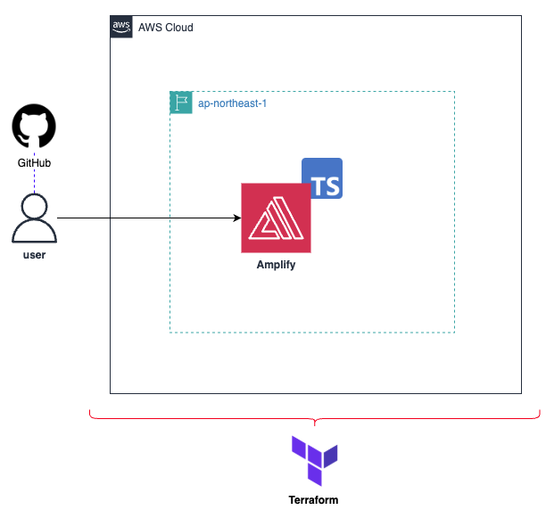

# terraform_amplify
## 構成イメージ


**CloudShellを利用される方は、以下を実行してください。**
## Set up Terraform on CloudShell
```sh
# Terraform v1.11.4 をダウンロード
wget https://releases.hashicorp.com/terraform/1.11.4/terraform_1.11.4_linux_amd64.zip

# 解凍して /usr/local/bin に配置
sudo unzip terraform_1.11.4_linux_amd64.zip -d /usr/local/bin/

# バージョン確認
terraform --version  # Terraform v1.11.4
```

## Setting Your GitHub PAT(Personal Access Token)
- Create `infra/terraform.tfvars` 
```sh
github_oauth_token = "Your_GitHub_PAT"
github_repository_url = "Your_GitHub_Repo_URL"
```
